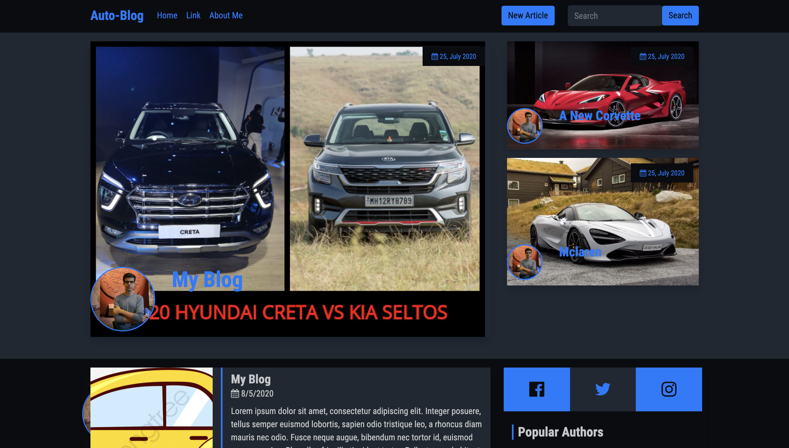

<!-- PROJECT HEADER -->
<br />
<p align="center">

  <h3 align="center">Auto-Blog</h3>

  <p align="center">
    I created this dynamic and responsive auto - blogging website using HTML and EJS, and styled it using CSS. This wesbite makes it adding, removing, and editing your blogs very easy and convinient.
  </p>
</p>


<!-- TABLE OF CONTENTS -->
## Table of Contents

* [About the Project](#about-the-project)
  * [Built With](#built-with)
* [Getting Started](#getting-started)
  * [Prerequisites](#prerequisites)
  * [Installation](#installation)
* [Usage](#usage)
* [Roadmap](#roadmap)
* [Contributing](#contributing)
* [License](#license)
* [Contact](#contact)
* [Acknowledgements](#acknowledgements)


<!-- ABOUT THE PROJECT -->
## About The Project
<a href="https://github.com/prakchat1999/Auto-Blog">
    
  </a>
<a href="https://github.com/prakchat1999/Auto-Blog">
    
  </a>

I created this website because: I have a passion for cars and coding, and a convenient Auto - Blogging website is the best way to:

* I have a passion for cars and coding.
* I wanted a convenient Auto - Blogging website where I could write my blogs conveniently.
* I wanted a place to connect with my fellow petrolheads.

### Built With

* [Bootstrap](https://getbootstrap.com)
* [HTML](https://html.com/)
* [CSS](https://www.w3.org/Style/CSS/Overview.en.html)
* [EJS](https://ejs.co/)


### Installation and Usage

1. Clone the repo
```sh
git clone https://github.com/prakchat1999/Auto-Blog.git
```
2. Install NPM packages
```sh
npm install
```
3. Run Server.js
```sh
node server.js
```

<!-- CONTRIBUTING -->
## Contributing

Contributions are what make the open source community such an amazing place to be learn, inspire, and create. Any contributions you make are **greatly appreciated**.

1. Fork the Project
2. Create your Feature Branch (`git checkout -b feature/AmazingFeature`)
3. Commit your Changes (`git commit -m 'Add some AmazingFeature'`)
4. Push to the Branch (`git push origin feature/AmazingFeature`)
5. Open a Pull Request


<!-- LICENSE -->
## License

Distributed under the MIT License. See `LICENSE` for more information.


<!-- CONTACT -->
## Contact

Your Name - pchaturvedi@umass.edu

Project Link: [https://github.com/prakchat1999/Auto-Blog.git](https://github.com/prakchat1999/Auto-Blog.git)


<!-- ACKNOWLEDGEMENTS -->
## Acknowledgements
* [Choose an Open Source License](https://choosealicense.com)
* [GitHub Pages](https://pages.github.com)
* [Font Awesome](https://fontawesome.com)
* [Google Fonts](https://fonts.google.com)
